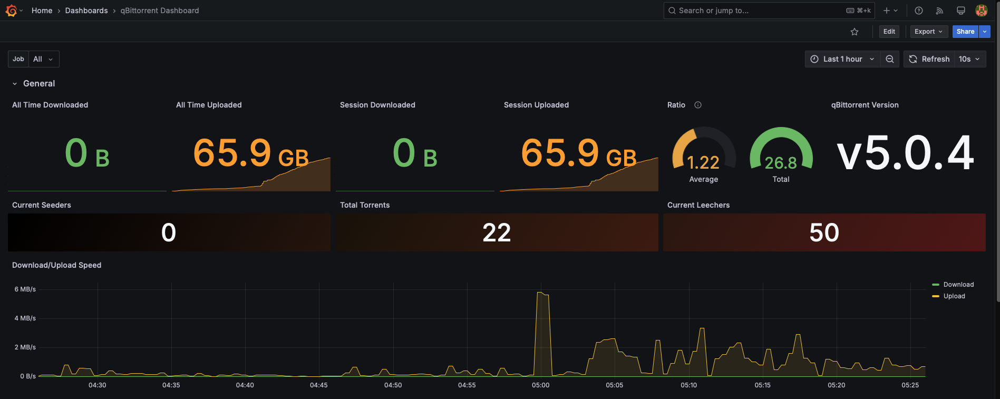
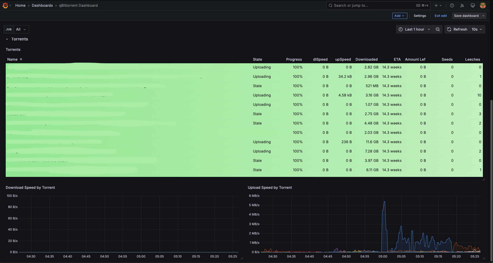

# qBittorrent Exporter

## Deployment options

- [Docker deployment](docs/deploy/Docker.md)
- [Systemd deployment](docs/deploy/Systemd.md)

## Grafana dashboard

[Dashboard](https://grafana.com/grafana/dashboards/23261-qbittorrent-dashboard/)




## Prometheus config

```yaml
  - job_name: 'qbittorrent_exporter'
    static_configs:
      - targets: ['<qbe_ip>:<port>']
```

### Credits

Inspired by [@caseyscarborough](https://github.com/caseyscarborough/qbittorrent-exporter)
